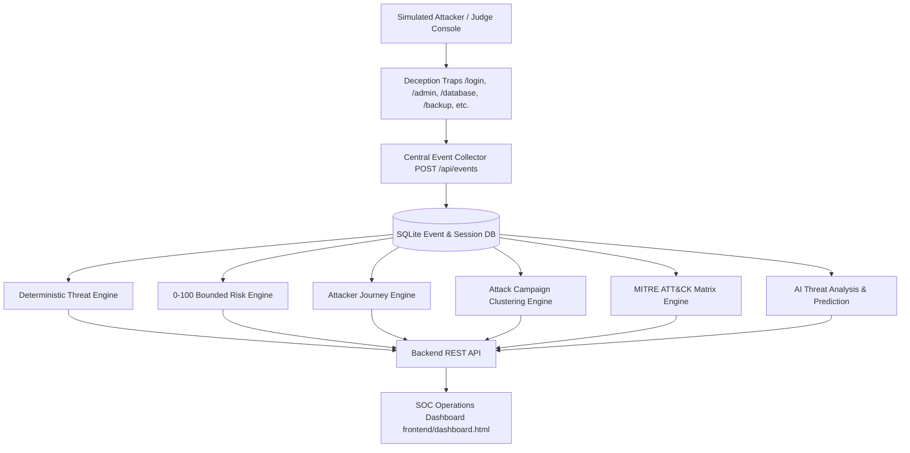

# NetDecoy — AI-Driven Honeypot & Threat Intelligence Platform

### From Attacker Activity to Actionable Threat Intelligence

> **NetDecoy** is a controlled, AI-assisted deception and threat-intelligence platform. It observes simulated attacker interactions across synthetic traps, detects suspicious activity, calculates an explainable risk score, maps the chronological attacker journey, correlates attack campaigns, visualizes the enterprise MITRE ATT&CK matrix in real time, and synthesizes executive threat intelligence and containment directives.

- **Project:** NetDecoy
- **Event:** IEEE SYNAPSE 2026
- **Team Name:** core-innovators
- **Safety Model:** Controlled simulation using synthetic resources and safe deception telemetry.
- **Status:** Fully Integrated End-to-End (Backend, SOC Dashboard, AI Intelligence, Deception Traps, MITRE Heatmap)

---

## Executive Overview & SOC Operations

The SOC Dashboard is the primary visual operations center for NetDecoy. Designed for rapid threat comprehension, it provides security analysts, SOC teams, and presentation judges with an immediate, high-level operational picture within seconds of observation.

```text
┌───────────────────────────────────────────────────────────────────────────────────┐
│ NETDECOY — SECURITY OPERATIONS CENTER (SOC)                                       │
├───────────────┬───────────────────┬─────────────────────┬─────────────────────────┤
│ Total Events  │ Threats Detected  │ High Risk Sessions  │ Active Sessions         │
│ 148           │ 42                │ 3                   │ 5                       │
├───────────────┴───────────────────┴─────────────────────┴─────────────────────────┤
│ LIVE EVENT FEED                                                                   │
│ 14:31:04  /login     Failed Authentication                HIGH     185.220.101.5  │
│ 14:31:08  /admin     Endpoint Enumeration Probed          MEDIUM   185.220.101.5  │
│ 14:31:13  /database  SQL-Like Input Detected              CRITICAL 185.220.101.5  │
├──────────────────────────────────────┬────────────────────────────────────────────┤
│ THREAT RISK ASSESSMENT               │ ATTACKER ORIGIN GEOLOCATION MAP            │
│ Score: 87 / 100 [CRITICAL]           │ Frankfurt, Germany (50.1109, 8.6821)       │
│ Breakdown: Brute Force (+20), SQLi   │ Interactive Leaflet Dark Map with Ping     │
├──────────────────────────────────────┴────────────────────────────────────────────┤
│ INTERACTIVE MITRE ATT&CK HEATMAP MATRIX                                           │
│ [Reconnaissance] [Initial Access] [Execution] [Credential Access] [Discovery] ... │
│  T1595.002 (Heat)  T1190 (85% Crit) T1059 (0%)   T1110.003 (60% High) T1083 (40%)  │
├───────────────────────────────────────────────────────────────────────────────────┤
│ ATTACKER CHRONOLOGICAL JOURNEY TIMELINE                                           │
│ [LOGIN] ➔ [ADMIN] ➔ [DATABASE] ➔ [BACKUP] ➔ [API]                                 │
├───────────────────────────────────────────────────────────────────────────────────┤
│ AI THREAT ANALYSIS ENGINE & NEXT STAGE PREDICTOR                                  │
│ Executive Summary: Attacker session sess_8832 initiated credential brute force... │
│ Evidence: Multiple failed logins, admin scanning, SQL injection payload           │
│ Containment: Block IP 185.220.101.5, revoke session sess_8832                     │
│ Estimated Next Phase: PRIVILEGE ESCALATION (Confidence: 82%)                      │
└───────────────────────────────────────────────────────────────────────────────────┘
```

---

## Core Capabilities & Features

### 1. Interactive MITRE ATT&CK Matrix Heatmap Widget (`GET /api/mitre`)
- **Real-Time Enterprise Matrix Mapping**: Evaluates honeypot events against **7 core MITRE tactics**:
  - `TA0043` Reconnaissance (T1595.002, T1592)
  - `TA0001` Initial Access (T1190, T1078.001)
  - `TA0002` Execution (T1059)
  - `TA0006` Credential Access (T1110.003, T1552.001)
  - `TA0007` Discovery (T1083, T1046)
  - `TA0004` Privilege Escalation (T1078.004)
  - `TA0010` Exfiltration (T1567)
- **Dynamic Heat Intensity**: Color-coded severity indicators with animated glow (`CRITICAL`, `HIGH`, `MEDIUM`, `INACTIVE`).
- **Deep-Dive Technique Inspector Modal**: On-click technique modal displaying technical descriptions, intercepted evidence payloads, CISA/NIST containment directives, telemetry filter buttons, and official MITRE ATT&CK documentation links.

### 2. Campaign Clustering & Correlation (`GET /api/clusters`)
- Groups concurrent individual events into unified multi-stage attack campaigns.
- Summarizes target endpoints, affected attack vectors, severity levels, and automated containment directives per cluster.

### 3. Automated Incident Response & Forensic Report Export (`GET /api/report`)
- Generates instant executive-level forensic incident reports.
- Exports complete attack summaries, risk scoring breakdowns, chronological event timelines, MITRE tactic mapping, and actionable containment checklists.

### 4. Bounded Explainable Threat Risk Gauge (`GET /api/risk`)
- 0–100 bounded additive risk scoring engine with dynamic severity bands:
  - **LOW**: 0–29
  - **MEDIUM**: 30–59
  - **HIGH**: 60–79
  - **CRITICAL**: 80–100
- Transparent point breakdown attributing specific score contributions to detected attack behaviors (e.g. SQLi +30, Brute Force +20, Path Traversal +25).

### 5. Live Real-Time Attacker Geolocation Map (`GET /api/geo`)
- Plots approximate attacker origin using dark CartoDB tiles and custom glowing map markers.
- Integrates live public IP geolocation with automatic offline fallback.

### 6. Attacker Chronological Journey Timeline (`GET /api/journey`)
- Visual node-link workflow tracing the adversary's lateral movement across traps over time.
- Categorizes each step by severity, timestamp, and target trap route.

### 7. AI Threat Analysis & Next Stage Predictor (`GET /api/analysis`, `GET /api/prediction`)
- LLM-synthesized executive threat summary with structured telemetry evidence bullets and recommended containment actions.
- Heuristic and pattern-based estimation of future attacker trajectories with confidence scoring.

### 8. Interactive Deception Trap Suite & Attack Simulators
- **6 Synthetic Decoy Traps**:
  - `/login`: SSO Authentication Trap (Brute-Force & Credential Stuffing)
  - `/admin`: Admin Console Trap (Privilege Escalation & Endpoint Enumeration)
  - `/database`: SQL Workbench Trap (SQL Injection & Union Exploitation)
  - `/backup`: Corporate Backup Vault Trap (Decoy Data Exfiltration)
  - `/api-explorer`: REST API Explorer Trap (Schema Probing & Token Forgery)
  - `/search`: Internal Search Portal Trap (Path Traversal & Sensitive File Leakage)
- **Attacker Console (`/traps/attacker.html`)**: Direct attack execution console for testing live responses.
- **Judge Demo Runner (`/demo`)**: Standalone 5-stage automated attack chain simulator.

---

## Architecture & Data Flow



---

## Repository Structure

```text
Net-Decoy/
├── backend/
│   ├── app.py                     # Flask application factory & unified web server
│   ├── manage.py                  # CLI management tool (init, reset, seed, status)
│   ├── routes/                    # REST API routes (events, risk, mitre, clusters, report, etc.)
│   │   ├── events.py              # Ingestion & event filtering
│   │   ├── risk.py                # Bounded risk assessment
│   │   ├── mitre.py               # MITRE ATT&CK heatmap & technique inspector
│   │   ├── clusters.py            # Attack campaign clustering
│   │   ├── report.py              # Forensic incident report generation
│   │   ├── journey.py             # Attacker lateral movement timeline
│   │   ├── analysis.py            # AI threat synthesis
│   │   ├── prediction.py          # Next likely stage prediction
│   │   ├── geo.py                 # Attacker IP geolocation
│   │   └── quarantine.py          # Active defense containment
│   ├── services/                  # Collector, session, risk, journey, AI bridge
│   └── database/                  # SQLite models, engine, and init scripts
├── frontend/
│   ├── dashboard.html             # Single-Page SOC Dashboard with MITRE Heatmap
│   ├── dashboard.css              # Custom cybersecurity theme styling & animations
│   └── dashboard.js               # Reactive polling, state management, Leaflet map, MITRE modal
├── traps/
│   ├── index.html                 # Apex Global Corporate Hub trap portal
│   ├── login.html                 # SSO Login trap
│   ├── admin.html                 # Admin console trap
│   ├── backup.html                # Backup portal trap
│   ├── database.html              # SQL workbench trap
│   ├── api.html                   # API explorer trap
│   ├── search.html                # Document search trap
│   ├── attacker.html              # Interactive Attacker Simulation Console
│   ├── demo_runner.html           # 5-Stage interactive attack sequence runner
│   ├── collector_client.py        # Python SDK for trap event emission
│   └── assets/                    # Shared styles & trap telemetry logger JS
├── intelligence/
│   ├── pipeline.py                # Unified intelligence analysis pipeline
│   ├── threat_engine.py           # Deterministic heuristic attack detectors
│   ├── risk_engine.py             # 0-100 bounded additive risk scoring
│   ├── journey_engine.py          # Chronological timeline and stage mapper
│   ├── ai_engine.py               # Gemini AI threat summarization & fallback
│   └── prediction_engine.py       # Next-stage heuristic trajectory predictor
├── scripts/
│   └── simulate_attack.py         # Multi-stage live hackathon attack simulator
├── shared/
│   ├── event_schema.json          # Shared telemetry JSON schema definition
│   └── api_contract.md            # Frontend-Backend API specification
└── tests/                         # Full pytest test suite (55 tests, 100% passing)
```

---

## Quick Start & Running Locally

### Prerequisites
- Python 3.10+
- Modern Web Browser (Chrome, Firefox, Edge, Safari)

### 1. Install Dependencies
```bash
pip install -r requirements.txt
```

### 2. Start the Unified Server
```bash
python backend/app.py
```
*The server starts on `http://localhost:5000`.*

### 3. Access the Dashboard and Traps
- **SOC Operations Dashboard**: [`http://localhost:5000/dashboard`](http://localhost:5000/dashboard) (or [`http://localhost:5000/`](http://localhost:5000/))
- **Honeypot Trap Portal**: [`http://localhost:5000/traps`](http://localhost:5000/traps)
- **Interactive Attacker Console**: [`http://localhost:5000/traps/attacker.html`](http://localhost:5000/traps/attacker.html)
- **Interactive Judge Demo Runner**: [`http://localhost:5000/demo`](http://localhost:5000/demo)

### 4. Run the Automated Attack Simulation (Terminal Demo)
Open a separate terminal window and run:
```bash
python scripts/simulate_attack.py
```
Watch the SOC Dashboard update instantly with live telemetry, MITRE heatmap tiles glowing, risk scores updating, and AI threat profiles generating!

---

## Running the Test Suite

Run the automated test suite covering all backend APIs, detection heuristics, MITRE ATT&CK matrix evaluation, clustering, risk scoring, journey timelines, and schema contracts:

```bash
python -m pytest tests/ -v
```
*(All 55 test cases run and pass cleanly).*

---

## REST API Endpoints Summary

| Method | Endpoint | Description |
|---|---|---|
| `GET` | `/api/health` | Backend and database health check |
| `POST` | `/api/events` | Ingest trap interaction telemetry event |
| `GET` | `/api/events` | List captured events with optional query filters |
| `GET` | `/api/stats` | Aggregated metrics (total events, threats, sessions) |
| `GET` | `/api/mitre` | Evaluates live events against 7 MITRE ATT&CK tactics & techniques |
| `GET` | `/api/clusters` | Correlates concurrent events into attack campaigns |
| `GET` | `/api/report` | Generates comprehensive incident & forensic export report |
| `GET` | `/api/risk` | 0–100 bounded explainable risk score with breakdown |
| `GET` | `/api/journey` | Chronological attacker lateral movement timeline |
| `GET` | `/api/analysis` | AI-generated executive summary, evidence, actions |
| `GET` | `/api/prediction` | Next likely attack stage estimation with confidence |
| `GET` | `/api/geo` | Attacker IP geolocation coordinates & city location |
| `GET` | `/api/alerts` | Real-time high and critical severity alert notifications |
| `GET` | `/api/metrics` | Top target traps, top attacker IPs, distribution charts |
| `GET` | `/api/sessions` | Active and historical session profiles |
| `POST` | `/api/quarantine` | Active defense IP quarantine / containment trigger |
| `POST` | `/api/reset` | Clean demo state reset |

---

## Team & Roles

- **M1 — Backend & Integration Lead**: Chaitanya Sarkate
- **M2 — Frontend & SOC Dashboard Lead**: Sarthak Gaikwad
- **M3 — Intelligence & AI Lead**: Vishvjeet Kamble
- **M4 — Deception & Trap Engineer**: Ajit Bhandekar

---

## License

This project is developed for IEEE SYNAPSE 2026 under the MIT License.
