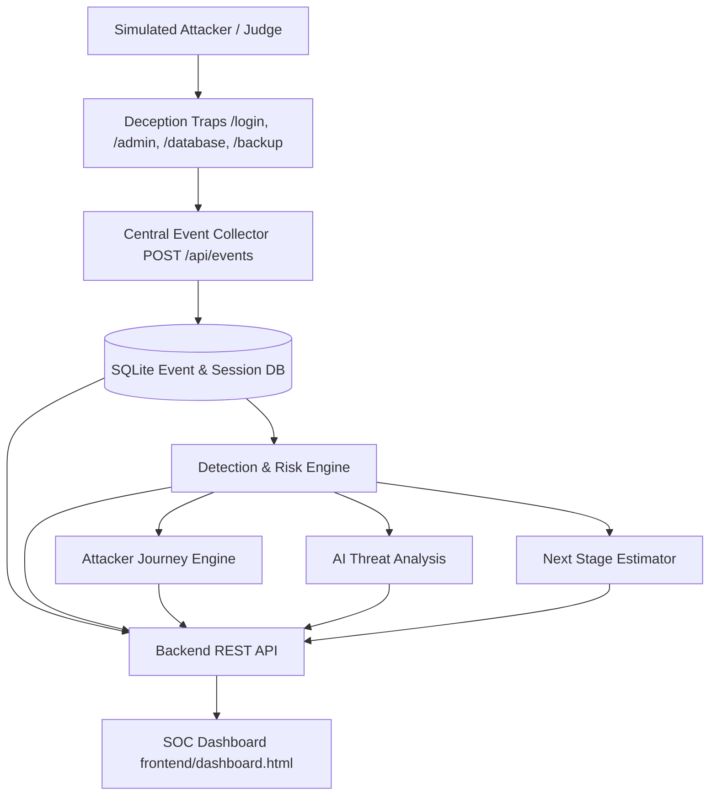

# NetDecoy — AI-Driven Honeypot & Threat Intelligence Platform

### From Attacker Activity to Actionable Threat Intelligence

> **NetDecoy** is a controlled, AI-assisted deception and threat-intelligence platform. It observes simulated attacker interactions across synthetic traps, detects suspicious activity, calculates an explainable risk score, maps the chronological attacker journey, explains the telemetry with AI, and estimates the next likely attack stage.

- **Project:** NetDecoy
- **Event:** IEEE SYNAPSE 2026
- **Team Name:** core-innovators
- **Safety Model:** Controlled simulation using synthetic resources and safe deception telemetry.
- **Status:** Fully Integrated End-to-End (Backend, SOC Dashboard, AI Intelligence, Deception Traps)

---

## 🛡️ Executive Overview & SOC Dashboard

The SOC Dashboard is the primary visual operations center for NetDecoy. Designed for rapid threat comprehension, it provides security analysts and presentation judges with an immediate, high-level operational picture within 10 seconds of observation.

```text
┌─────────────────────────────────────────────────────────────────────────────┐
│ 🛡️ NETDECOY — SECURITY OPERATIONS CENTER (SOC)                            │
├───────────────┬───────────────────┬─────────────────────┬───────────────────┤
│ Total Events  │ Threats Detected  │ High Risk Sessions  │ Active Sessions   │
│ 148           │ 42                │ 3                   │ 5                 │
├───────────────┴───────────────────┴─────────────────────┴───────────────────┤
│ LIVE EVENT FEED                                                             │
│ 14:31:04  /login     Failed Authentication                HIGH    185.220.101.5 │
│ 14:31:08  /admin     Endpoint Enumeration Probed          MEDIUM  185.220.101.5 │
│ 14:31:13  /database  SQL-Like Input Detected              CRITICAL 185.220.101.5│
├──────────────────────────────────────┬──────────────────────────────────────┤
│ THREAT RISK ASSESSMENT               │ ATTACKER ORIGIN GEOLOCATION MAP      │
│ Score: 87 / 100 [CRITICAL]           │ Frankfurt, Germany (50.1109, 8.6821) │
│ Breakdown: Brute Force (+20), SQLi(+30)│ Interactive Dark Leaflet Map Pin    │
├──────────────────────────────────────┴──────────────────────────────────────┤
│ ATTACKER CHRONOLOGICAL JOURNEY MAP                                          │
│ [LOGIN] ➔ [ADMIN] ➔ [DATABASE] ➔ [BACKUP] ➔ [API]                           │
├─────────────────────────────────────────────────────────────────────────────┤
│ 🧠 AI THREAT ANALYSIS ENGINE                                                 │
│ Executive Summary: Attacker session sess_8832 initiated credential brute... │
│ Evidence: Multiple failed logins, admin scanning, SQL injection payload     │
│ Containment: Block IP 185.220.101.5, revoke session sess_8832                │
├─────────────────────────────────────────────────────────────────────────────┤
│ 🔮 NEXT LIKELY ATTACK STAGE                                                 │
│ Estimated Next Phase: PRIVILEGE ESCALATION (Pattern Confidence: 78%)        │
└─────────────────────────────────────────────────────────────────────────────┘
```

---

## 🚀 Key Features

1. **Top Metrics Cards**: Real-time counters for Total Events, Threats Detected, High Risk Sessions, and Active Sessions (`GET /api/stats`).
2. **Live Event Feed Table**: Filtering by severity (`CRITICAL`, `HIGH`, `MEDIUM`, `LOW`), showing ISO timestamps, trap routes, actions, and source IPs (`GET /api/events`).
3. **Bounded Threat Risk Gauge**: 0–100 risk score meter with dynamic severity status bands (LOW: 0–29, MEDIUM: 30–59, HIGH: 60–79, CRITICAL: 80–100) and explicit points breakdown list (`GET /api/risk`).
4. **Interactive Leaflet Geolocation Map**: Plots approximate attacker origin using dark CartoDB tiles and custom glowing map markers (`GET /api/geo`). Includes automatic fallback if IP geolocation is unavailable.
5. **Attacker Chronological Journey Map**: Visual step-by-step node flow connecting attacker movement across traps (`GET /api/journey`).
6. **AI Threat Analysis Panel**: Dedicated card displaying LLM-synthesized executive threat summary, structured telemetry evidence bullets, and recommended containment actions (`GET /api/analysis`).
7. **Next Stage Prediction Card**: Pattern-based estimate of future attacker trajectory with pattern confidence bar (`GET /api/prediction`).
8. **Judge Demo Simulator & Reset**: Built-in standalone demo sequence controls (`Brute-Force`, `Scan`, `SQLi`, `Full Attack Chain`) and state reset (`POST /api/reset`).
9. **Unified Single-Port Web Service**: Flask app serves both the SOC Dashboard (`/dashboard`) and all 6 Honeypot Deception Traps (`/traps`, `/login`, `/admin`, `/backup`, `/database`, `/api-explorer`, `/search`, `/demo`) seamlessly.

---

## 🛠️ Architecture & Data Flow



---

## 📁 Repository Structure

```text
Net-Decoy/
├── backend/
│   ├── app.py                     # Flask application factory & static web server
│   ├── manage.py                  # CLI management tool (init, reset, seed, status)
│   ├── routes/                    # REST API routes (/api/events, /api/risk, etc.)
│   ├── services/                  # Collector, session, risk, journey, AI bridge
│   └── database/                  # SQLite models, engine, and init scripts
├── frontend/
│   ├── dashboard.html             # Single-Page SOC Dashboard
│   ├── dashboard.css              # Custom cybersecurity theme styling
│   └── dashboard.js               # Reactive polling, state management, Leaflet map
├── traps/
│   ├── index.html                 # Apex Global Corporate Hub trap
│   ├── login.html                 # SSO Login trap
│   ├── admin.html                 # Admin console trap
│   ├── backup.html                # Backup portal trap
│   ├── database.html              # SQL workbench trap
│   ├── api.html                   # API explorer trap
│   ├── search.html                # Document search trap
│   ├── demo_runner.html           # 5-Stage interactive attack sequence runner
│   ├── collector_client.py        # Python SDK for trap event emission
│   └── assets/                    # Shared styles & trap telemetry logger JS
├── intelligence/
│   ├── pipeline.py                # Unified intelligence analysis pipeline
│   ├── threat_engine.py           # Deterministic heuristic attack detectors
│   ├── risk_engine.py             # 0-100 bounded additive risk scoring
│   ├── journey_engine.py          # Chronological timeline and stage mapper
│   ├── ai_engine.py               # Gemini AI threat summarization & fallback
│   └── prediction_engine.py       # Next-stage heuristic trajectory predictor
├── scripts/
│   └── simulate_attack.py         # Multi-stage live hackathon attack simulator
├── shared/
│   ├── event_schema.json          # Shared telemetry JSON schema definition
│   └── api_contract.md            # Frontend-Backend API specification
└── tests/                         # Full pytest integration test suite (52 tests)
```

---

## 💻 Quick Start & Running Locally

### Prerequisites
- Python 3.10+
- Modern Web Browser (Chrome, Firefox, Edge, Safari)

### 1. Install Dependencies
```bash
pip install -r requirements.txt
```

### 2. Start the Unified Server
```bash
python backend/app.py
```
*The server starts on `http://localhost:5000`.*

### 3. Open the Dashboard and Traps in Your Browser
- 📊 **SOC Dashboard**: [`http://localhost:5000/dashboard`](http://localhost:5000/dashboard)
- 🪤 **Honeypot Trap Portal**: [`http://localhost:5000/traps`](http://localhost:5000/traps)
- 🚀 **Interactive Attack Demo Runner**: [`http://localhost:5000/demo`](http://localhost:5000/demo)

### 4. Run the Automated Attack Simulation (Terminal Demo)
Open a new terminal window and run:
```bash
python scripts/simulate_attack.py
```
Watch the SOC Dashboard update instantly with live telemetry, map pins, risk scores, chronological journey nodes, and AI threat profiles!

---

## 🧪 Running the Test Suite

Run the full automated test suite covering all backend APIs, detection heuristics, risk scoring, journey timelines, prediction heuristics, and schema contracts:

```bash
python -m pytest tests/ -v
```

---

## 📡 REST API Endpoints Summary

| Method | Endpoint | Description |
|---|---|---|
| `GET` | `/api/health` | Backend and database health check |
| `POST` | `/api/events` | Ingest trap interaction telemetry event |
| `GET` | `/api/events` | List captured events with optional query filters |
| `GET` | `/api/stats` | Aggregated metrics (total events, threats, sessions) |
| `GET` | `/api/risk` | 0–100 bounded risk score with breakdown |
| `GET` | `/api/journey` | Chronological attacker movement timeline |
| `GET` | `/api/analysis` | AI-generated executive summary, evidence, actions |
| `GET` | `/api/prediction` | Next likely attack stage estimation |
| `GET` | `/api/geo` | Attacker IP geolocation coordinates & city |
| `GET` | `/api/alerts` | Real-time high and critical severity alerts |
| `GET` | `/api/metrics` | Top target traps, top attacker IPs, distribution |
| `GET` | `/api/sessions` | Active and historical session profiles |
| `POST` | `/api/quarantine` | Active defense IP quarantine / containment |
| `POST` | `/api/reset` | Clean demo state reset |

---

## 👥 Team & Roles

- **M1 — Backend & Integration Lead**: Chaitanya Sarkate
- **M2 — Frontend & SOC Dashboard Lead**: Sarthak Gaikwad
- **M3 — Intelligence & AI Lead**: Vishvjeet Kamble
- **M4 — Deception & Trap Engineer**: Ajit Bhandekar

---

## 📄 License

This project is developed for IEEE SYNAPSE 2026 under the MIT License.
