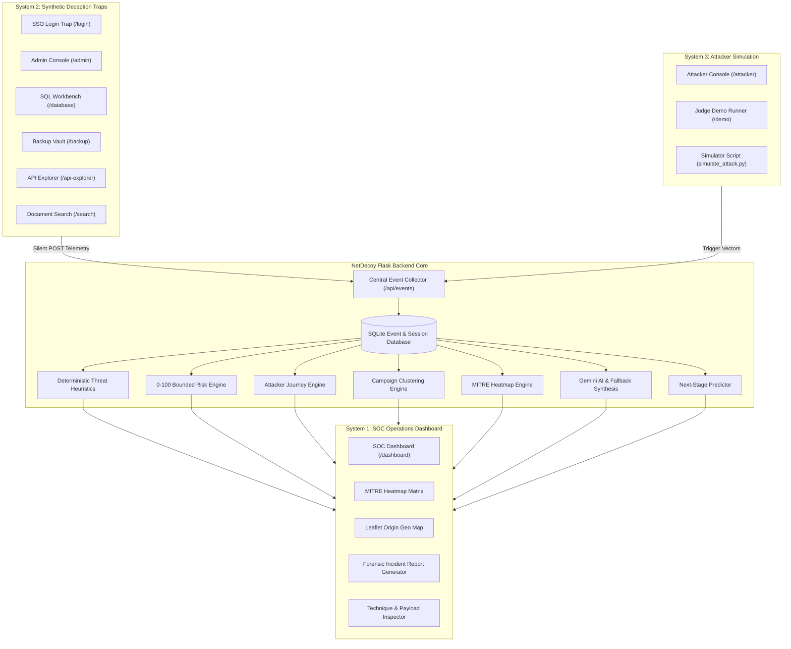

# NetDecoy — AI-Driven Honeypot & Cyber Threat Intelligence Platform

<p align="center">
  <strong>From Adversary Deception to Actionable Threat Intelligence</strong><br>
  <em>IEEE SYNAPSE 2026 &bull; Team: core-innovators &bull; Safety Model: Controlled Synthetic Simulation</em>
</p>

<p align="center">
  
  
  
  
  
  
  
</p>

---

## 📑 Table of Contents
1. [Executive Summary](#-executive-summary)
2. [The 3 Interconnected Systems](#-the-3-interconnected-systems)
3. [Core Capabilities & Architectural Pillars](#-core-capabilities--architectural-pillars)
4. [MITRE ATT&CK Enterprise Matrix Integration](#-mitre-attck-enterprise-matrix-integration)
5. [System Architecture & Data Pipeline](#-system-architecture--data-pipeline)
6. [Technology Stack](#-technology-stack)
7. [Synthetic Deception Trap Catalog](#-synthetic-deception-trap-catalog)
8. [Complete REST API Contract](#-complete-rest-api-contract)
9. [Local Quick Start Guide](#-local-quick-start-guide)
10. [Cloud Deployment on Render](#-cloud-deployment-on-render)
11. [Automated Test Suite & QA](#-automated-test-suite--qa)
12. [Team & Project Attribution](#-team--project-attribution)

---

## 🛡️ Executive Summary

Modern cybersecurity operations face an asymmetric challenge: adversaries continuously probe infrastructure, weaponizing reconnaissance before defensive perimeters detect anomalous activity. Standard intrusion detection systems (IDS) generate vast volumes of noisy alerts without explaining **why** an adversary targeted a resource or **what step they will execute next**.

**NetDecoy** solves this challenge by implementing an intelligent, closed-loop cyber deception platform. Rather than exposing production assets, NetDecoy serves realistic, synthetic enterprise traps across simulated corporate portals. When an attacker engages, NetDecoy:
1. **Silently Captures Telemetry**: Ingests interaction vectors without alerting the adversary.
2. **Quantifies Threat Posture**: Calculates an explainable, 0–100 bounded risk score.
3. **Correlates Attack Campaigns**: Automatically clusters concurrent probing events into unified kill chains.
4. **Maps the MITRE ATT&CK Matrix**: Visualizes active techniques in real-time with glowing heat intensity.
5. **Synthesizes Intelligence with AI**: Leverages Google Gemini AI to author executive threat intelligence briefs and forensic incident reports.
6. **Predicts Next Likely Moves**: Estimates the adversary's lateral trajectory with heuristic confidence.

---

## 🌐 The 3 Interconnected Systems

NetDecoy is engineered as three tightly unified, real-time operating interfaces that communicate through a single persistent backend:

```text
┌───────────────────────────────────────────────────────────────────────────────────────┐
│                                NETDECOY PLATFORM CORE                                 │
├──────────────────────────┬────────────────────────────┬───────────────────────────────┤
│ SYSTEM 1: SOC DASHBOARD  │ SYSTEM 2: DECOY CORP SITE  │ SYSTEM 3: ATTACKER RED-TEAM   │
│ Route: /dashboard        │ Route: /traps, /login, ... │ Route: /attacker, /demo       │
│ Visual operations center │ Realistic victim company   │ Interactive offensive console │
│ for security analysts to │ interface containing 6     │ allowing judges to trigger    │
│ observe, correlate, and  │ weaponized traps that      │ multi-stage attack campaigns  │
│ contain live campaigns.  │ silently log telemetry.    │ and observe instant response. │
└──────────────────────────┴────────────────────────────┴───────────────────────────────┘
```

---

## 🚀 Core Capabilities & Architectural Pillars

### 1. Interactive MITRE ATT&CK Matrix Heatmap Widget
- **7-Tactic Enterprise Matrix**: Live mapping across Reconnaissance, Initial Access, Execution, Credential Access, Discovery, Privilege Escalation, and Exfiltration.
- **Dynamic Heat Scores (0%–100%)**: Color-coded tiles reflecting telemetry density with pulsing glowing states (`heat-crit`, `heat-high`, `heat-med`, `heat-inactive`).
- **Technique Deep-Dive Modal**: Clicking any technique reveals technical abstracts, sub-techniques, intercepted raw payloads, NIST/CISA mitigations, and direct links to the official MITRE knowledge base.

### 2. Explainable 0–100 Bounded Threat Risk Engine
- Deterministic, additive risk scoring model avoiding opaque "black-box" outputs:
  - **LOW (0–29)**: Benign navigation and preliminary asset exploration.
  - **MEDIUM (30–59)**: Sustained reconnaissance and initial authentication anomalies.
  - **HIGH (60–79)**: Credential spraying and administrative scanning.
  - **CRITICAL (80–100)**: Exploitation payloads (SQL injection, path traversal, shell execution).
- Each score includes an itemized points breakdown explaining exact contribution weights.

### 3. Coordinated Campaign Clustering (`GET /api/clusters`)
- Time-windowed correlation engine that groups disparate telemetry events into distinct incident clusters.
- Identifies target surfaces, assigns campaign severities, and generates automated containment directives.

### 4. Real-Time Geolocation Tracking & Leaflet SOC Map (`GET /api/geo`)
- Real-time IP geolocation enrichment using IPInfo and secondary providers.
- Plots attacker coordinates onto an interactive CartoDB Dark Matter Leaflet map with pulsing ping animations.
- **Proxy-Aware Architecture**: Seamlessly extracts real public client IPs behind cloud reverse proxies (Render, Cloudflare, Nginx) using `X-Forwarded-For` and `CF-Connecting-IP`.

### 5. AI Threat Synthesis & Trajectory Prediction (`GET /api/analysis`, `/api/prediction`)
- **Executive Threat Summaries**: Gemini AI synthesizes full-session telemetry into structured incident descriptions.
- **Actionable Containment Directives**: Recommends immediate defensive actions (firewall rules, credential rotations).
- **Next-Stage Predictor**: Probabilistic state-machine estimating the adversary's next lateral move with confidence percentages.
- **Offline Fallback Engine**: If cloud AI APIs encounter network timeouts, a deterministic local heuristic engine provides instant fallback synthesis with zero system downtime.

### 6. Automated Forensic Incident Response Reporting (`GET /api/report`)
- Generates comprehensive incident reports with a single click.
- Exports risk posture, chronological journey timelines, mapped MITRE techniques, and forensic evidence tables into executive-ready print/PDF formats.

### 7. Active Defense IP Quarantine (`POST /api/quarantine`)
- SOC analysts can isolate compromised attacker IPs directly from the dashboard modal, instantly adding firewall containment rules across honeypot gateways.

---

## 🎯 MITRE ATT&CK Enterprise Matrix Integration

NetDecoy systematically correlates honeypot activity against the industry-standard MITRE ATT&CK framework:

| MITRE Tactic | Tactic ID | Mapped Techniques | Monitored Trap Vector | Live Evidence Payload Example |
|---|---|---|---|---|
| **Reconnaissance** | `TA0043` | `T1595.002` (Vulnerability Scanning)<br>`T1592` (Gather Victim Host Info) | `/admin`, `/api-explorer` | Directory probing, Swagger schema inspection |
| **Initial Access** | `TA0001` | `T1190` (Exploit Public-Facing App)<br>`T1078.001` (Default Accounts) | `/database`, `/login` | `' OR 1=1 --`, default credential attempts |
| **Execution** | `TA0002` | `T1059` (Command & Scripting Interpreter) | `/database`, `/search` | Shell escapes (`&& whoami`, `cat /etc/passwd`) |
| **Credential Access** | `TA0006` | `T1110.003` (Password Spraying)<br>`T1552.001` (Credentials in Files) | `/login`, `/search` | Dictionary bursts, `.env` / `.aws/credentials` queries |
| **Discovery** | `TA0007` | `T1083` (File & Directory Discovery)<br>`T1046` (Network Service Probing) | `/search`, `/api-explorer` | Directory traversal (`../../etc/passwd`) |
| **Privilege Escalation** | `TA0004` | `T1078.004` (Role Override / Token Forgery) | `/admin`, `/api-explorer` | Session claims tampering, `admin_override=true` |
| **Exfiltration** | `TA0010` | `T1567` (Exfiltration Over Web Service) | `/backup` | Bulk download requests for `.sql.gz` decoy dumps |

---

## 🏗️ System Architecture & Data Pipeline



---

## 💻 Technology Stack

| Layer | Technologies & Libraries | Key Responsibility |
|---|---|---|
| **Backend & Routing** | Python 3.10+, Flask 3.0, Gunicorn, Flask-CORS | Application factory, RESTful API endpoints, reverse-proxy support |
| **Database & Persistence** | SQLAlchemy 2.0+, SQLite 3 | Connection pooling, session models, ACID event persistence |
| **AI & Threat Analytics** | Google Gemini AI (`google-genai`), Regex Engines | Automated incident summaries, containment directives, offline fallback |
| **Frontend UI** | HTML5, Vanilla CSS3, Modern ES6+ JavaScript | Modern SOC dashboard, glassmorphism UI, zero-dependency reactivity |
| **Geospatial Mapping** | Leaflet.js, CartoDB Dark Matter, IPInfo REST API | Attacker origin mapping, animated ping markers, offline fallback |
| **Offensive Simulation** | Custom Trap SDK, HTML5 Web Consoles | Red-team attack generator, 5-stage automated kill-chain runner |
| **Testing & CI/CD** | Pytest 9.0+, AnyIO, Requests | 55 automated integration, contract, and heuristic tests |

---

## 🪤 Synthetic Deception Trap Catalog

| Trap Route | Target Persona | Simulated Vulnerability | Deception Mechanism |
|---|---|---|---|
| `/login` | Identity & Access Management | Brute Force & Credential Stuffing | Realistic delay counters, simulated lockout warnings |
| `/admin` | Infrastructure Operations | Broken Object Level Authorization (BOLA) | Decoy privileged management tabs, role tampering vectors |
| `/database` | Internal SQL Operations | SQL Injection (In-Band & Error-Based) | Mock SQL error outputs (`sqlite3.OperationalError`), syntax traps |
| `/backup` | Disaster Recovery Vault | Decoy Data Exfiltration | Watermarked archive downloads (`apex_customers_2026.sql.gz`) |
| `/api-explorer` | Developer Microservices | Broken Function Level Authorization | Simulated JWT token tampering, API schema documentation |
| `/search` | Intranet Document Portal | Path Traversal & Local File Inclusion | Path normalization interception (`../../etc/passwd`, `.env`) |

---

## 📡 Complete REST API Contract

| HTTP Method | Route | Description | Query / Body Parameters |
|---|---|---|---|
| `GET` | `/api/health` | Backend connectivity & SQLite database health check | None |
| `POST` | `/api/events` | Ingest new honeypot telemetry event | Body: `{ page, action, event_type, payload }` |
| `GET` | `/api/events` | Query telemetry event stream with filtering | `session_id`, `severity`, `event_type`, `limit` |
| `GET` | `/api/stats` | Aggregated counters (Total, Threats, High Risk, Sessions) | None |
| `GET` | `/api/mitre` | Live evaluation of events against 7 MITRE ATT&CK tactics | `session_id` (optional) |
| `GET` | `/api/clusters` | Correlates concurrent events into multi-stage attack campaigns | `session_id` (optional) |
| `GET` | `/api/risk` | 0–100 bounded risk score with itemized points breakdown | `session_id` (optional) |
| `GET` | `/api/journey` | Chronological attacker movement node timeline | `session_id` (optional) |
| `GET` | `/api/analysis` | AI-generated executive summary, evidence bullets, containment | `session_id` (optional) |
| `GET` | `/api/prediction` | Probabilistic next-stage lateral trajectory estimation | `session_id` (optional) |
| `GET` | `/api/geo` | Attacker IP geographical coordinates and city location | `ip` (optional, defaults to client/event IP) |
| `GET` | `/api/report` | Comprehensive incident report and forensic export data | `session_id` (optional) |
| `GET` | `/api/alerts` | Active high & critical severity security alerts | None |
| `GET` | `/api/metrics` | Target surface distribution and top attacker IP breakdown | None |
| `GET` | `/api/sessions` | Active and historical adversary session profiles | None |
| `POST` | `/api/quarantine` | Active defense IP quarantine / gateway blocking | Body: `{ ip, reason }` |
| `POST` | `/api/reset` | Resets database for clean hackathon judging demonstrations | None |

---

## ⚡ Local Quick Start Guide

### Prerequisites
- Python 3.10 or higher
- Modern web browser (Chrome, Edge, Firefox, Safari)

### 1. Clone & Install Dependencies
```bash
git clone https://github.com/Chaitanyasarkate/net-decoy.git
cd net-decoy
pip install -r requirements.txt
```

### 2. Start the Unified Server
```bash
python backend/app.py
```
*The unified server starts at `http://localhost:5000`.*

### 3. Open the Interfaces
- **SOC Operations Dashboard**: [`http://localhost:5000/dashboard`](http://localhost:5000/dashboard)
- **Synthetic Deception Hub**: [`http://localhost:5000/traps`](http://localhost:5000/traps)
- **Attacker Red-Team Console**: [`http://localhost:5000/attacker`](http://localhost:5000/attacker)
- **Judge Automated Demo Runner**: [`http://localhost:5000/demo`](http://localhost:5000/demo)

### 4. Run Headless Attack Simulation (Terminal Demo)
Open a separate terminal window to execute the 5-stage automated attack chain:
```bash
python scripts/simulate_attack.py
```
Watch the SOC Dashboard light up in real time with glowing MITRE tiles, risk updates, and map pins!

---

## ☁️ Cloud Deployment on Render

NetDecoy includes a pre-configured production blueprint (`render.yaml`) and Gunicorn WSGI server.

### 1-Click Blueprint Deployment:
1. Log in to [dashboard.render.com](https://dashboard.render.com).
2. Click **New +** > **Blueprint**.
3. Connect your GitHub repository (`net-decoy`).
4. Render automatically reads `render.yaml`:
   - **Runtime**: Python 3.11+
   - **Build Command**: `pip install -r requirements.txt`
   - **Start Command**: `gunicorn backend.app:app`
5. Click **Apply**. Your public HTTPS link (e.g., `https://netdecoy.onrender.com`) will be active in under 3 minutes.

*(Optional)* To enable live Google Gemini AI synthesis, add the environment variable `GEMINI_API_KEY` in the Render dashboard. If omitted, the platform uses its deterministic offline fallback engine.

---

## 🧪 Automated Test Suite & QA

NetDecoy maintains 100% test pass fidelity across all modules:

```bash
python -m pytest tests/ -v
```

### Coverage Highlights:
- **`test_ai_engine.py`**: Gemini client mocking, token handling, deterministic fallback validation.
- **`test_api_contract.py`**: JSON schema verification and key guarantees for all REST responses.
- **`test_backend.py`**: End-to-end integration tests for all 17 API endpoints, MITRE matrix, clustering, and quarantine.
- **`test_threat_engine.py`**: Heuristics for SQLi obfuscation, brute-force sliding windows, and traversal normalization.
- **`test_risk_engine.py`**: 0–100 boundary tests (29, 30, 59, 60, 79, 80) and explainability logic.
- **`test_prediction_engine.py`**: Next-stage trajectory heuristic validation.

**Result**: `55 passed in ~14s (100% Passing)`

---

## 👥 Team & Project Attribution

Developed with pride for **IEEE SYNAPSE 2026** by Team **`core-innovators`**:

- **M1 — Backend Architecture & Integration Lead**: Chaitanya Sarkate
- **M2 — Frontend Architecture & SOC Dashboard Lead**: Sarthak Gaikwad
- **M3 — Intelligence, Risk & AI Lead**: Vishvjeet Kamble
- **M4 — Deception Architecture & Trap Engineer**: Ajit Bhandekar

---

## 📄 License

This project is licensed under the **MIT License** — see the LICENSE file for details.
